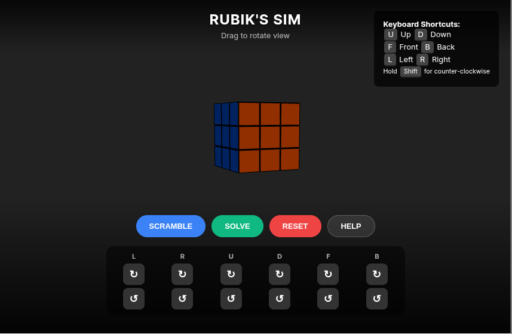

# 🧊 3D Rubik's Cube Simulator

An interactive and fully responsive 3x3x3 Rubik's Cube simulator built using Three.js. This project provides a smooth 3D experience, allowing users to practice solving, scramble the cube, and even automatically solve it using move history.

## 🔗 Live Demo
Try the simulator directly in your browser:  
https://mohakamran.github.io/rubik/

## 🖼️ Screenshot
The following image shows the simulator interface and 3D cube rendering:  


## ✨ Features
- **Immersive 3D Graphics:** Realistic rendering powered by Three.js.
- **Fully Responsive:** Works smoothly on both desktop and mobile devices.
- **Move History Solver:** The Solve button reverses all recorded moves to return the cube to its solved state.
- **Scramble Function:** Generates a standard 20-move scramble.
- **Flexible Controls:** Supports mouse/touch rotation, on-screen buttons, and keyboard shortcuts.
- **Adjustable View:** Drag to rotate the camera around the cube.

## 🎮 Controls

### Mouse / Touch Controls
| Action | Input | Description |
|--------|--------|-------------|
| Rotate View | Drag anywhere | Changes the camera angle |

### On-Screen Buttons
| Action | Button | Description |
|--------|---------|-------------|
| Scramble | Scramble | Randomly shuffles the cube |
| Solve | Solve | Reverses all moves to solve the cube |
| Reset | Reset | Resets the cube to the initial solved state |

### Keyboard Controls
| Action | Keys | Description |
|--------|--------|-------------|
| Face Rotation (Clockwise) | U, D, L, R, F, B | Executes standard face rotations |
| Face Rotation (Counter-Clockwise) | Shift + (U, D, L, R, F, B) | Executes prime moves (U', R', etc.) |

## 🛠️ Project Structure & Technology
This is a single-file web application built for simplicity and portability.
- **Framework:** HTML, CSS, JavaScript (ES Modules)
- **3D Library:** Three.js
- **Controls:** OrbitControls for camera movement

## 🚀 Getting Started

### 1. Clone the Repository
```bash
git clone https://github.com/mohakamran/rubik.git
cd rubik

2. Run the Project
Open the index.html file directly in any modern web browser. No additional setup required.
